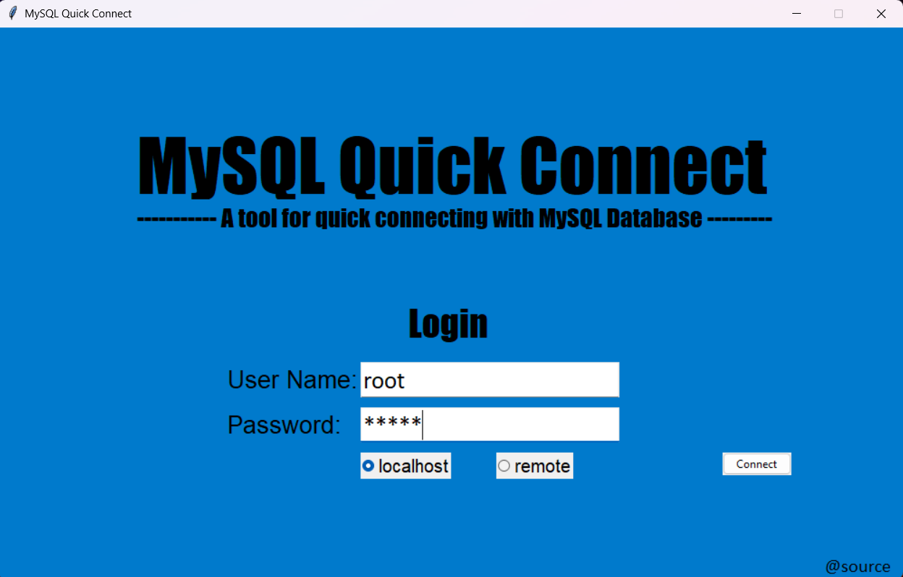
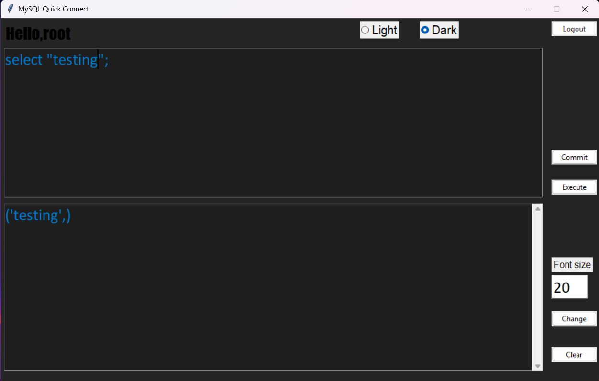

<p align="center">
  
</p>

<h1 align="center">QuickConnect</h1>

<p align="center">
  A simple, open-source MySQL connector and query editor with native Dark Mode.
</p>

---

## 📖 Overview
**QuickConnect** is a lightweight application designed for writing and executing SQL commands. It was created to provide a built-in dark mode interface, offering a comfortable alternative to official MySQL tools that often lack a native dark theme.

## 📥 Download & Use
For the easiest way to get started, download the standalone executable:

1. Go to the **[Releases](https://github.com/stapak/MySQL-QuickConnect/releases)** page.
2. Download the `QuickConnect.exe` file.
3. Run the file directly (no installation required).

## 🖼️ Screenshots

### Connection Settings

*The simple interface to connect to your local  MySQL server.*


*The simple interface to connect to your  remote MySQL server.*

### Query Editor

*The primary workspace for writing and executing SQL scripts.*


## 🛠️ Key Features
* **Dark Mode:** A clean, dark interface to reduce eye strain.
* **Simple Execution:** Write SQL and run it with a single click.
* **Lightweight:** Fast startup and minimal system resource usage.
* **Open Source:** Community-driven and free to use.

## 🛠️ Development Setup

1. **Download/Clone:**
   ```bash
   git clone [https://github.com/your-username/QuickConnect.git](https://github.com/your-username/QuickConnect.git)
   ```

2. **Install Dependencies:**
    * Before running QuickConnect, you need to install the MySQL connector for Python. Run the following command in your terminal:
    ```bash
    pip install mysql-connector-python
    ```
    
3. **Execute**
     * **start_quick_connect.py** in suitable python environment. 
